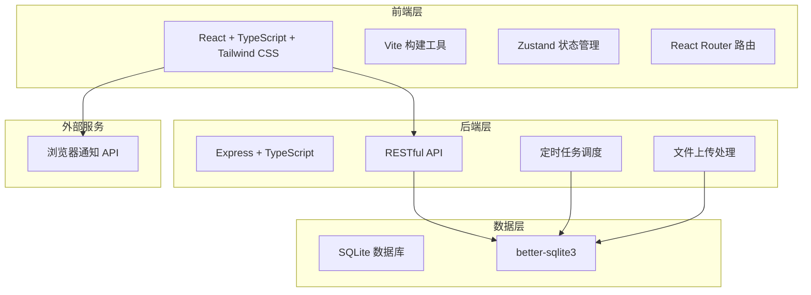
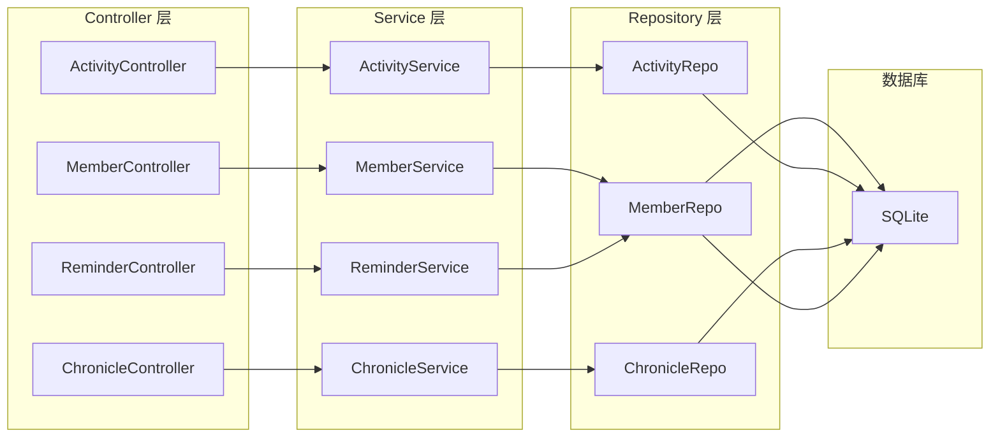
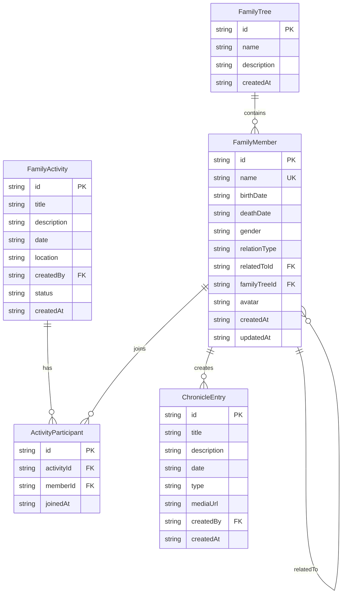

## 1. 架构设计



## 2. 技术说明

- **前端**：React@18 + Tailwind CSS@3 + Vite
- **初始化工具**：vite-init (react-express-ts 模板)
- **后端**：Express@4 + TypeScript
- **数据库**：SQLite (better-sqlite3)
- **状态管理**：Zustand
- **路由**：React Router DOM
- **家谱可视化**：Canvas 自绘谱系图（支持缩放、拖拽、节点交互）
- **PDF导出**：jsPDF + html2canvas
- **图标**：Lucide React
- **定时任务**：node-cron

## 3. 路由定义

| 路由 | 用途 |
|------|------|
| / | 仪表盘首页，展示家族概览、活动、提醒 |
| /family-tree | 家谱树页面，交互式谱系图 |
| /activities | 家庭活动列表页 |
| /chronicle | 家族编年史时间线页 |

## 4. API 定义

### 4.1 家庭成员 API

```typescript
interface FamilyMember {
  id: string;
  name: string;
  birthDate: string;
  deathDate?: string;
  relationType: "parent" | "child" | "spouse" | "sibling";
  relatedToId?: string;
  gender: "male" | "female";
  avatar?: string;
  familyTreeId: string;
  createdAt: string;
  updatedAt: string;
}

// GET    /api/members          - 获取所有成员
// POST   /api/members          - 添加成员（含校验）
// PUT    /api/members/:id      - 更新成员
// DELETE /api/members/:id      - 删除成员
// GET    /api/members/tree     - 获取家谱树结构
```

### 4.2 家庭活动 API

```typescript
interface FamilyActivity {
  id: string;
  title: string;
  description: string;
  date: string;
  location: string;
  createdBy: string;
  participants: string[];
  status: "upcoming" | "ongoing" | "ended";
  createdAt: string;
}

// GET    /api/activities           - 获取活动列表
// POST   /api/activities           - 创建活动
// POST   /api/activities/:id/join  - 报名活动
// DELETE /api/activities/:id/join  - 取消报名
// GET    /api/activities/:id       - 获取活动详情
```

### 4.3 家族编年史 API

```typescript
interface ChronicleEntry {
  id: string;
  title: string;
  description: string;
  date: string;
  type: "photo" | "story" | "event";
  mediaUrl?: string;
  createdBy: string;
  createdAt: string;
}

// GET    /api/chronicle         - 获取编年史条目列表（按时间排序）
// POST   /api/chronicle         - 创建编年史条目
// POST   /api/chronicle/upload  - 上传照片/文件
// GET    /api/chronicle/export  - 导出PDF
```

### 4.4 生日提醒 API

```typescript
interface BirthdayReminder {
  memberId: string;
  memberName: string;
  birthDate: string;
  daysUntil: number;
  giftSuggestions: string[];
}

// GET /api/reminders/birthdays - 获取近期生日提醒
```

## 5. 服务端架构图



## 6. 数据模型

### 6.1 数据模型定义



### 6.2 数据定义语言

```sql
CREATE TABLE family_trees (
  id TEXT PRIMARY KEY,
  name TEXT NOT NULL,
  description TEXT,
  created_at TEXT NOT NULL DEFAULT (datetime('now'))
);

CREATE TABLE family_members (
  id TEXT PRIMARY KEY,
  name TEXT NOT NULL,
  birth_date TEXT NOT NULL,
  death_date TEXT,
  gender TEXT NOT NULL CHECK (gender IN ('male', 'female')),
  relation_type TEXT NOT NULL CHECK (relation_type IN ('parent', 'child', 'spouse', 'sibling')),
  related_to_id TEXT,
  family_tree_id TEXT NOT NULL,
  avatar TEXT,
  created_at TEXT NOT NULL DEFAULT (datetime('now')),
  updated_at TEXT NOT NULL DEFAULT (datetime('now')),
  FOREIGN KEY (related_to_id) REFERENCES family_members(id),
  FOREIGN KEY (family_tree_id) REFERENCES family_trees(id)
);

CREATE TABLE family_activities (
  id TEXT PRIMARY KEY,
  title TEXT NOT NULL,
  description TEXT,
  date TEXT NOT NULL,
  location TEXT,
  created_by TEXT NOT NULL,
  status TEXT NOT NULL DEFAULT 'upcoming' CHECK (status IN ('upcoming', 'ongoing', 'ended')),
  created_at TEXT NOT NULL DEFAULT (datetime('now')),
  FOREIGN KEY (created_by) REFERENCES family_members(id)
);

CREATE TABLE activity_participants (
  id TEXT PRIMARY KEY,
  activity_id TEXT NOT NULL,
  member_id TEXT NOT NULL,
  joined_at TEXT NOT NULL DEFAULT (datetime('now')),
  FOREIGN KEY (activity_id) REFERENCES family_activities(id),
  FOREIGN KEY (member_id) REFERENCES family_members(id),
  UNIQUE (activity_id, member_id)
);

CREATE TABLE chronicle_entries (
  id TEXT PRIMARY KEY,
  title TEXT NOT NULL,
  description TEXT,
  date TEXT NOT NULL,
  type TEXT NOT NULL CHECK (type IN ('photo', 'story', 'event')),
  media_url TEXT,
  created_by TEXT NOT NULL,
  created_at TEXT NOT NULL DEFAULT (datetime('now')),
  FOREIGN KEY (created_by) REFERENCES family_members(id)
);

-- 初始化默认家谱
INSERT INTO family_trees (id, name, description) VALUES ('default', '我的家族', '默认家族家谱');
```
